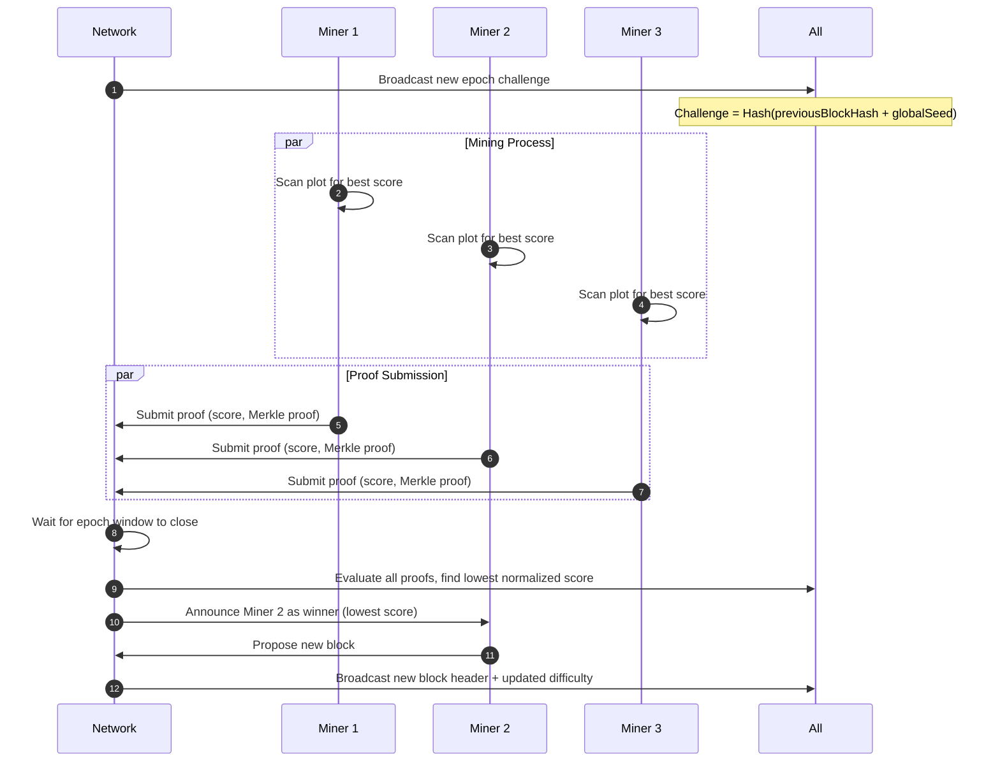
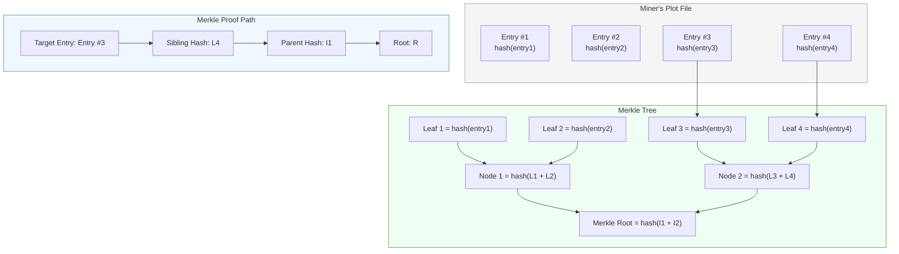

# 🛸 Spacetime Blockchain — Discovery Notes

This document summarizes key concepts, design decisions, and clarifications from the design of **Spacetime**, a Proof-of-Space-Time (PoST) blockchain.

---

## Table of Contents

1. [Mining Approach](#1-mining-approach)
2. [Challenge Window and Epochs](#2-challenge-window-and-epochs)
3. [Plots and Deterministic Data](#3-plots-and-deterministic-data)
4. [Merkle Tree and Merkle Root](#4-merkle-tree-and-merkle-root)
   - [4a. Pseudocode Section — Build Merkle Tree](#4a-pseudocode-section--build-merkle-tree)
   - [4b. Pseudocode Section — Generate Merkle Proof](#4b-pseudocode-section--generate-merkle-proof)
   - [4c. Pseudocode Section — Verify Merkle Proof](#4c-pseudocode-section--verify-merkle-proof)
5. [Node Design](#5-node-design)
6. [Shared Challenge vs Individual](#6-shared-challenge-vs-individual)
7. [Difficulty Control](#7-difficulty-control)
8. [Summary of Mining Process](#8-summary-of-mining-process)
9. [Design Principles](#9-design-principles)
10. [References / Inspirations](#10-references--inspirations)
11. [Pseudocode Section — Plot Scanning and Proof Submission](#11-pseudocode-section--plot-scanning-and-proof-submission)
    - [Plot File Management and Size Limits](#plot-file-management-and-size-limits)
12. [Epoch Timeline Diagram](#12-epoch-timeline-diagram)
13. [Plot Structure and Merkle Proof Diagram](#13-plot-structure-and-merkle-proof-diagram)
14. [Network Layer and Message Types](#14-network-layer-and-message-types)
15. [Security Considerations](#15-security-considerations)
    - [15.1 Core Security Goals](#151-core-security-goals)
    - [15.2 Attack Vectors and Mitigations](#152-attack-vectors-and-mitigations)
    - [15.3 Time as a Security Anchor](#153-time-as-a-security-anchor)
    - [15.4 Space as a Resource Constraint](#154-space-as-a-resource-constraint)
    - [15.5 Cryptographic Components](#155-cryptographic-components)
    - [15.6 Difficulty and Network Stability](#156-difficulty-and-network-stability)
    - [15.7 Summary](#157-summary)
16. [Development Roadmap](#16-development-roadmap)
    - [16.1 Phase 1 — Core Foundations (Local Prototype)](#161-phase-1--core-foundations-local-prototype)
    - [16.2 Phase 2 — Proof-of-Space-and-Time Implementation](#162-phase-2--proof-of-space-and-time-implementation)
    - [16.3 Phase 3 — Networking and P2P Layer](#163-phase-3--networking-and-p2p-layer)
    - [16.4 Phase 4 — Validation, Consensus, and Chain Finalization](#164-phase-4--validation-consensus-and-chain-finalization)
    - [16.5 Phase 5 — Wallets, Transactions, and Rewards](#165-phase-5--wallets-transactions-and-rewards)
    - [16.6 Phase 6 — Network Hardening and Security](#166-phase-6--network-hardening-and-security)
    - [16.7 Phase 7 — Optimization and Visualization](#167-phase-7--optimization-and-visualization)
    - [16.8 Phase 8 — Mainnet Preparation](#168-phase-8--mainnet-preparation)
17. [Merkle Tree & Proof Generation Notes](#17-merkle-tree--proof-generation-notes)
18. [Glossary of Terms](#18-glossary-of-terms)

---

## 1. Mining Approach

- PoST chosen over PoW/PoS:
  - Energy-efficient, fair, and mineable.
  - Combines disk space and time online as scarce resources.
- Plots: miners pre-generate deterministic, unique files on disk.
  - Deterministic per miner (based on key/seed).
  - Each plot entry contributes to potential proof scores.
- Proof selection:
  - Each miner computes the lowest score for the epoch.
  - Epoch-based selection ensures fairness over network latency.
- Challenge:
  - A single challenge per epoch is generated from previous block + deterministic seed.
  - All miners compete on the same challenge.

---

## 2. Challenge Window and Epochs

- Epoch: fixed time window (e.g., 30 seconds) during which miners submit proofs.
- Open challenge window:
  - All proofs are collected during the epoch.
  - Miner with lowest score at the end of the epoch wins the block.
- Time component:
  - Miners must remain active across epochs to maintain eligibility.
  - Failure to submit proofs reduces eligibility (“time decay”).

---

## 3. Plots and Deterministic Data

- Deterministic data:
  - Each miner generates unique plot data from their own keys and a seed.
  - Same key + seed always produces the same plot.
- Plot scanning:
  - Score for each entry: score = Hash(challenge + entryValue)
  - Miner tracks lowest score to submit proof.
- Merkle tree usage in plots:
  - Plot entries can be organized into a Merkle tree.
  - Merkle root stored in plot header.
  - Proofs include Merkle paths to verify entries without reading entire plot.

---

## 4. Merkle Tree and Merkle Root

- Merkle tree:
  - Binary hash tree summarizing a set of data (e.g., transactions, plot entries).
  - Parent node = hash of concatenated child hashes.
- Merkle root:
  - Single hash representing the entire dataset.
  - Changing any leaf invalidates the root.
- Uses in Spacetime:
  1. Block transactions: root in block header for tamper-proof verification.
  2. Plot verification: proofs reference Merkle paths to ensure entry validity.

### 4a. Pseudocode Section — Build Merkle Tree
*Label: `BuildMerkleTree(dataItems)`*  
- Inputs: list of data items  
- Outputs: Merkle root hash  
- Steps:  
  1. Hash each data item → create leaf nodes  
  2. Pair hashes and hash recursively until one root remains  
  3. Return final hash as Merkle root

### 4b. Pseudocode Section — Generate Merkle Proof
*Label: `GenerateMerkleProof(dataItems, targetItem)`*  
- Inputs: list of data items, target item  
- Outputs: proof (list of sibling hashes + side info)  
- Steps:  
  1. Identify index of target item  
  2. Iterate through tree levels, recording sibling hashes along the path  
  3. Return list of hashes forming the proof

### 4c. Pseudocode Section — Verify Merkle Proof
*Label: `VerifyMerkleProof(targetItem, proof, merkleRoot)`*  
- Inputs: target item, proof, Merkle root  
- Output: boolean (true if valid)  
- Steps:  
  1. Initialize current hash as Hash(target item)  
  2. Iteratively combine with sibling hashes per proof direction  
  3. Compare final hash with Merkle root

---

## 5. Node Design

- Node type: .NET console application (primary miner and network process)
- Networking: P2P TCP or WebSocket layer for message propagation
- Web/API: optional dashboard or RPC layer; secondary to node process
- Project layout:
  - `Spacetime.Node` — console app entry point
  - `Spacetime.Blockchain` — blocks, chainstate, transactions
  - `Spacetime.Consensus` — PoST logic
  - `Spacetime.Plots` — disk plot creation & verification
  - `Spacetime.Network` — P2P layer
  - `Spacetime.Wallet` — key management, signing
  - `Spacetime.API` — optional dashboard/RPC

---

## 6. Shared Challenge vs Individual

- All nodes use the same challenge per epoch, derived deterministically:
  - challenge = Hash(previousBlockHash + globalSeed)  
- Each miner’s plot is unique, producing different candidate scores  
- Single challenge ensures consensus while preserving miner uniqueness

---

## 7. Difficulty Control

- Difficulty defines how “hard” it is to produce a winning proof  
- Dynamic difficulty based on rolling average block time:
  - newDifficulty = currentDifficulty * (avgBlockTime / targetBlockTime)
- Apply difficulty to normalized score:
  - normalizedScore = score / difficulty
- Optional enhancements:
  - Weight by plot size: weightedScore = score / plotSize  
  - Smoothing using EMA  
  - Minimum difficulty to prevent very easy epochs

---

## 8. Summary of Mining Process

1. Compute epoch challenge (shared, deterministic)  
2. Scan unique plot for entries → calculate score  
3. Track best score for the epoch  
4. Broadcast proof (score + Merkle path) during epoch window  
5. At epoch end:
   - Compare all submitted proofs  
   - Lowest normalized score wins → miner proposes new block  
6. Update rolling average block time → adjust difficulty for next epoch

---

## 9. Design Principles

- Fairness: all miners compete on same challenge; low-latency doesn’t dominate  
- Energy efficiency: mostly disk reads + light hashing  
- Determinism: nodes independently derive same challenge and validate proofs  
- Extensibility: modular project structure allows dashboards, RPC, or extra consensus features

---

## 10. References / Inspirations

- [Chia Network — Proof of Space](https://www.chia.net/)  
- [XRPL Consensus Protocol](https://xrpl.org/consensus.html)  
- Nakamoto consensus (Bitcoin)  

---

## 11. Pseudocode Section — Plot Scanning and Proof Submission

*Label: `ScanPlotAndSubmitProof(epochChallenge, plot, difficulty)`*  

### Purpose
- Shows the miner’s main workflow for a single epoch
- Includes scoring plot entries, tracking best score, and submitting proof to the network

### Inputs
- `epochChallenge` — the deterministic challenge for the current epoch
- `plot` — the miner’s pre-generated plot entries
- `difficulty` — current difficulty for normalizing scores

### Outputs
- Miner’s best proof for the epoch (to be broadcast)

### Steps
1. Initialize `bestScore` to infinity
2. Initialize `bestEntry` to null
3. For each `entry` in `plot`:
   - Compute `score = Hash(epochChallenge + entry)`
   - Normalize score using difficulty:
     ```
     normalizedScore = score / difficulty
     ```
   - If `normalizedScore < bestScore`:
     - Set `bestScore = normalizedScore`
     - Set `bestEntry = entry`
4. After scanning all entries, generate Merkle proof for `bestEntry`
5. Construct `proofPacket` containing:
   - Miner ID or public key
   - `bestScore`
   - Merkle proof of entry
6. Broadcast `proofPacket` to peers during the epoch window
7. Wait for epoch to end and collect feedback on winning proof

### Notes
- This loop is disk- and memory-efficient; primarily reads the plot sequentially and computes lightweight hashes
- The same miner repeats this process every epoch
- Late submissions are ignored for fairness in epoch resolution

### Plot File Management and Size Limits

- **Multiple Plot Files**  
  Miners can generate multiple plot files, each representing a portion of their committed storage.  
  This allows flexibility in disk management, parallel proof computation, and incremental storage addition.  
  All plot files collectively contribute to the miner’s effective space for scoring.

- **File Size Limits**  
  The protocol can define **minimum and maximum plot file sizes** to ensure efficiency and fairness.  
  Users may choose a file size within this range (e.g., 50 GB–500 GB).  
  Total mining contribution is additive across all plot files.

- **Practical Considerations**  
  - Multiple smaller files allow parallel scanning and easier disk management.  
  - Single large files are simpler but reduce flexibility.  
  - Each proof references the Merkle root of the file containing the winning entry, ensuring verifiability.  
  - Protocol enforces limits to prevent gaming or I/O bottlenecks.

- **User Choice**  
  Miners can decide how much storage to commit and how to split it across plot files, within protocol limits.

## 12. Epoch Timeline Diagram

The diagram below illustrates the lifecycle of a single epoch — from the challenge broadcast to block proposal and difficulty adjustment.



### Diagram Explanation

1. **Challenge Broadcast**  
   The network deterministically creates a challenge using the previous block hash and a global seed.  
   All miners receive the same challenge and begin the epoch simultaneously.

2. **Plot Scanning**  
   Each miner independently scans their local plots to compute scores based on the challenge.  
   The miner keeps track of the best (lowest) normalized score found during the scan.

3. **Proof Submission**  
   Miners submit their best proofs — containing the score, Merkle proof, and identity — to the network within the epoch window.

4. **Winner Selection**  
   After the epoch window closes, the network compares all normalized scores.  
   The miner with the lowest score wins the right to propose the next block.

5. **Difficulty Adjustment**  
   The average block time is compared to the target block time.  
   The network adjusts the global difficulty accordingly for the next epoch to maintain consistent timing.

---

This diagram helps visualize the fairness and timing of PoST epochs in Spacetime.

## 13. Plot Structure and Merkle Proof Diagram

The diagram below illustrates the internal structure of a miner’s plot file and how Merkle proofs are used to validate a single plot entry.



### Diagram Explanation

1. **Plot File**  
   Each miner’s plot file contains a large set of entries derived from their key and a deterministic seed.  
   These entries are hashed and stored on disk, ready to be scanned for each epoch challenge.

2. **Merkle Tree Construction**  
   Each plot entry’s hash becomes a leaf node.  
   Pairs of leaf hashes are recursively hashed until a single **Merkle root** remains.  
   The Merkle root is stored in the plot’s header and used to verify individual entries later.

3. **Proof Generation**  
   When a miner finds their best entry for a challenge, they generate a **Merkle proof** showing that entry’s hash is part of the Merkle tree leading to the stored root.  
   The proof path consists of sibling hashes and their positional metadata (left/right).

4. **Proof Validation**  
   Other nodes can recompute the hash path from the provided entry and compare it to the stored Merkle root.  
   If they match, the proof is valid — confirming that the miner’s entry exists in the plot.

---

### ✅ Summary of Diagrams

| Diagram | Purpose |
|----------|----------|
| **Epoch Timeline Diagram** | Visualizes the mining cycle — from challenge to winner selection |
| **Plot Structure Diagram** | Shows how plots, Merkle trees, and proofs relate to each other |

---

## 14. Network Layer and Message Types

The Spacetime network layer enables decentralized coordination between miners and validators.  
It uses a lightweight peer-to-peer (P2P) protocol built over TCP or WebSocket connections.  

Each node maintains a peer list, exchanges status messages, and participates in challenge and block propagation.

---

### Network Overview

| Component | Purpose |
|------------|----------|
| **Node** | A running instance of the Spacetime software; can mine, validate, or relay messages. |
| **Peer Manager** | Handles peer discovery, connection management, and message routing. |
| **Message Bus** | Internal abstraction to broadcast and handle incoming network messages. |
| **Epoch Coordinator** | Tracks current epoch timing, generates challenges, and manages proof submissions. |
| **Blockchain Manager** | Validates, stores, and propagates blocks. |

---

### Message Types

| Message Type | Sender → Receiver | Purpose / Description |
|---------------|------------------|------------------------|
| **HELLO** | Node → Peer | Sent when connecting to a new peer; includes node ID, version, and capabilities. |
| **PEER_LIST** | Node → Peer | Shares known peers for network expansion. |
| **NEW_CHALLENGE** | Network → All Nodes | Broadcasts the epoch challenge derived from the previous block. Triggers the start of mining for the epoch. |
| **PROOF_SUBMISSION** | Miner → Network | Sent by miners during the epoch window. Contains the best proof, score, and Merkle proof path. |
| **PROOF_BROADCAST** | Network → All Nodes | Relays proof submissions so other nodes can verify and record them. |
| **EPOCH_CLOSE** | Network → All Nodes | Indicates the epoch window has ended; no further proof submissions are accepted. |
| **WINNER_ANNOUNCEMENT** | Network → All Nodes | Announces the miner with the lowest normalized score for the epoch. |
| **BLOCK_PROPOSAL** | Winner → Network | The winning miner proposes the next block containing transactions and metadata. |
| **BLOCK_VALIDATION** | Node → Network | Nodes validate the proposed block’s proofs and signatures before acceptance. |
| **BLOCK_ACCEPTED** | Network → All Nodes | Confirms the block has been validated and added to the canonical chain. |
| **CHAIN_SYNC** | Node ↔ Node | Requests or provides block headers and missing blocks for synchronization. |
| **PING / PONG** | Node ↔ Node | Used to measure latency and maintain active peer connections. |

---

### Message Data Structures (Conceptual)

| Field | Description |
|--------|--------------|
| **MessageType** | Identifies the type of message (e.g., `PROOF_SUBMISSION`, `BLOCK_PROPOSAL`). |
| **SenderID** | Public key or node identifier of the sender. |
| **Payload** | Serialized message-specific data (e.g., challenge hash, proof details). |
| **Signature** | Cryptographic signature ensuring authenticity and integrity. |
| **Timestamp** | Unix time to prevent replay and aid ordering. |

---

### Message Flow Example — Typical Epoch

1. **NEW_CHALLENGE** broadcast → all miners start scanning plots.  
2. Miners compute best scores and send **PROOF_SUBMISSION**.  
3. Network aggregates proofs and issues **EPOCH_CLOSE** when the window ends.  
4. The node with the best proof is announced via **WINNER_ANNOUNCEMENT**.  
5. The winner broadcasts a **BLOCK_PROPOSAL** containing the new block.  
6. Peers perform **BLOCK_VALIDATION**.  
7. If valid, the network propagates **BLOCK_ACCEPTED** and updates the chain state.  
8. Optional **CHAIN_SYNC** ensures lagging nodes are caught up before the next epoch.

---

### Networking Principles

- **Decentralization**: no central coordinator; all nodes follow deterministic challenge rules.  
- **Resilience**: nodes can drop or reconnect without disrupting consensus.  
- **Low Latency**: small message payloads ensure fast propagation during epoch windows.  
- **Security**: signatures ensure authenticity; peers only accept signed and timestamped messages.  
- **Extensibility**: message types can evolve (e.g., for governance or layer-2 features) without breaking backward compatibility.

---

### Example Development Plan for Networking Module

| Task | Description | Priority |
|-------|-------------|-----------|
| Define message schema | JSON or binary format with type field and payload | High |
| Implement peer discovery | Maintain peer list and connect to known nodes | High |
| Build message dispatcher | Central router that directs messages to appropriate handlers | High |
| Handle synchronization | Implement block header and block data sync | Medium |
| Add challenge broadcast logic | Deterministically issue `NEW_CHALLENGE` events | Medium |
| Add proof relay and validation | Ensure all proofs are verified before epoch closure | Medium |
| Optimize propagation | Use lightweight compression or batching for high network efficiency | Low |

---

### Summary

The network layer is the **spine** of the Spacetime protocol — it ensures that all nodes share:
- the same **challenges**,
- the same **proofs and blocks**, and  
- a consistent **chain state** across epochs.

Together with the consensus and plotting mechanisms, this forms the complete **Spacetime blockchain protocol**.

## 15. Security Considerations

The Spacetime blockchain relies on a hybrid of **Proof-of-Space** and **Proof-of-Time**, designed to achieve strong security and fairness while remaining energy-efficient.  
This section outlines the major security principles, potential attack vectors, and corresponding mitigations.

---

### 15.1 Core Security Goals

| Goal | Description |
|------|--------------|
| **Fairness** | Every miner’s chance of winning depends on the amount of space they commit, not computational speed. |
| **Sybil Resistance** | Nodes must commit significant storage to participate, making it expensive to create fake identities. |
| **Determinism** | All challenges and verifications are deterministic and publicly verifiable. |
| **Integrity** | Blocks, proofs, and messages are cryptographically signed and tamper-evident. |
| **Energy Efficiency** | Computation is minimal once plots are generated; the system favors storage over CPU cycles. |

---

### 15.2 Attack Vectors and Mitigations

| Attack Type | Description | Mitigation |
|--------------|-------------|-------------|
| **Sybil Attack** | An attacker spawns many fake nodes to dominate mining. | Storage commitment and key binding: each node must prove ownership of large pre-plotted data tied to a single public key. |
| **Grinding Attack** | Attempting to re-plot or regenerate plots rapidly to match new challenges. | Challenges are time-bound; epochs are short enough that re-plotting during an active challenge is infeasible. |
| **Plot Reuse / Copy Attack** | Using duplicated plot files to increase apparent space. | Plots include miner’s public key and nonce; duplicate plots produce identical proofs and are disqualified. |
| **Replay Attack** | Re-broadcasting old proofs or blocks to trick the network. | Proofs and messages include timestamps, epoch numbers, and challenge hashes to ensure freshness. |
| **Long-Range Attack** | Attempting to rewrite history by creating an alternate long chain. | Time proofs and cumulative epoch ordering prevent generating valid earlier blocks faster than real time. |
| **Eclipse Attack** | Isolating a node’s network view to feed it false data. | Peer discovery and random peer rotation ensure diverse connections; signed messages prevent falsification. |
| **Malicious Block Proposal** | A winner proposes a fraudulent block. | Validators independently verify proofs, Merkle roots, and signatures before block acceptance. |
| **Disk Spoofing** | Faking large disk plots without real storage usage. | Randomized read proofs (hash checks at specific offsets) ensure miners possess actual data on disk. |

---

### 15.3 Time as a Security Anchor

- The **Proof-of-Time (PoT)** element enforces **temporal honesty** — ensuring blocks progress roughly in real time.  
- Validators can reject blocks that arrive too early or too late relative to the expected epoch interval.  
- Combined with Proof-of-Space, this prevents attackers from “jumping ahead” by simulating future challenges or regenerating plots faster than time passes.

---

### 15.4 Space as a Resource Constraint

- Each miner’s **effective power** scales with the unique physical space committed.  
- Because disk space is a finite and rival resource, large-scale attacks require proportional investment in actual hardware.  
- This levels the playing field compared to compute-based systems where ASICs dominate.

---

### 15.5 Cryptographic Components

| Component | Purpose |
|------------|----------|
| **Hash Function (e.g., BLAKE3 or SHA-256)** | Generates deterministic and collision-resistant plot entries and proofs. |
| **Merkle Trees** | Provide compact, verifiable membership proofs for plot entries. |
| **Digital Signatures (e.g., Ed25519)** | Authenticate miners, validate network messages, and prevent forgery. |
| **Challenge Derivation** | Each challenge is derived from the previous block hash and epoch index, ensuring unpredictability. |

---

### 15.6 Difficulty and Network Stability

- The **difficulty target** dynamically adjusts based on rolling average block times.  
- This prevents sudden shifts in block frequency and maintains predictable network cadence.  
- Adjustments are small per epoch to avoid oscillation or manipulation by short-term spikes in participation.

---

### 15.7 Summary

| Principle | Description |
|------------|-------------|
| **Temporal Honesty** | Blocks must align with real-world time, enforced by Proof-of-Time verification. |
| **Storage Commitment** | Honest miners must pre-commit genuine disk plots bound to their identity. |
| **Cryptographic Validation** | Every proof and message is verifiable via public keys and hashes. |
| **Decentralized Coordination** | No single node controls challenge generation or winner selection. |
| **Adaptive Difficulty** | Keeps the system balanced and self-regulating as participation changes. |

---

Together, these mechanisms ensure that **Spacetime** remains secure, fair, and sustainable — leveraging *space* as the economic resource and *time* as the anchor of trust.

## 16. Development Roadmap

The Spacetime blockchain will be developed iteratively, starting from a minimal prototype and expanding toward a fully distributed, secure, and efficient network.  
Each phase builds upon the previous, allowing incremental learning, testing, and community feedback.

---

### 16.1 Phase 1 — Core Foundations (Local Prototype)

| Objective | Description |
|------------|-------------|
| **Initialize Project** | Create the `.NET` console application scaffold for the Spacetime node and miner. |
| **Define Data Models** | Implement core objects: `Block`, `Transaction`, `Plot`, `Proof`, `Challenge`, and `Epoch`. |
| **Implement Merkle Tree Library** | Build a simple Merkle tree generator and verifier. |
| **Local Blockchain Ledger** | Implement in-memory chain storage with basic validation and block linking. |
| **Challenge Generator** | Deterministically derive new challenges from the previous block hash. |
| **Plot Simulator** | Implement a small, local plot file generator for testing. |
| **Proof Evaluation Logic** | Add challenge scoring and best-proof selection algorithms. |

✅ **Goal:** Produce a single-node prototype that can generate challenges, compute proofs, and build a valid chain locally.

---

### 16.2 Phase 2 — Proof-of-Space-and-Time Implementation

| Objective | Description |
|------------|-------------|
| **Disk-Based Plotter** | Implement real on-disk plot generation (unique per miner key). |
| **Merkle Root Inclusion** | Store Merkle roots for plot files and embed them in block headers. |
| **Proof-of-Time Simulation** | Add an epoch timer enforcing minimum time per block and validating delays. |
| **Score Normalization** | Implement difficulty-based normalization to fairly compare proofs. |
| **Plot Verification** | Add logic to verify that proof paths match on-disk plots. |
| **Difficulty Retargeting** | Adjust global difficulty based on rolling average block time. |

✅ **Goal:** Achieve a functional Proof-of-Space-and-Time mining process on a single node.

---

### 16.3 Phase 3 — Networking and P2P Layer

| Objective | Description |
|------------|-------------|
| **P2P Module** | Build peer discovery, connection management, and message routing. |
| **Message Protocol** | Implement structured message types (see Section 14). |
| **Challenge Broadcasting** | Allow any node to relay new challenges across the network. |
| **Proof Submission Flow** | Miners submit and broadcast proofs to other peers. |
| **Epoch Coordination** | Enforce synchronized challenge windows among nodes. |
| **Block Propagation** | Enable block proposal, validation, and acceptance across the network. |
| **Chain Synchronization** | Implement header and block sync for late-joining nodes. |

✅ **Goal:** Create a minimal multi-node test network capable of propagating challenges, proofs, and blocks.

---

### 16.4 Phase 4 — Validation, Consensus, and Chain Finalization

| Objective | Description |
|------------|-------------|
| **Proof Validation Across Nodes** | Each node verifies submitted proofs independently. |
| **Winner Determination** | Select the miner with the best proof after each epoch window. |
| **Block Proposal Rules** | Enforce that only valid epoch winners can propose blocks. |
| **Block Validation Rules** | Validate block signatures, Merkle roots, and proof authenticity. |
| **Chain Reorganization Handling** | Manage forks by selecting the longest valid chain. |
| **Consensus State Machine** | Create a deterministic state model for block progression. |

✅ **Goal:** Establish a fully consistent consensus layer ensuring chain agreement among all peers.

---

### 16.5 Phase 5 — Wallets, Transactions, and Rewards

| Objective | Description |
|------------|-------------|
| **Wallet Module** | Generate and manage public/private keys. |
| **Transaction Pool** | Implement mempool for pending transactions. |
| **Block Rewards** | Award mining rewards to block winners. |
| **Transaction Fees** | Introduce transaction fees and fee distribution. |
| **Basic CLI Wallet** | Allow users to check balances, send transactions, and view block info. |

✅ **Goal:** Introduce economic incentives and enable meaningful blockchain transactions.

---

### 16.6 Phase 6 — Network Hardening and Security

| Objective | Description |
|------------|-------------|
| **Digital Signatures** | Add Ed25519 signing to all messages and blocks. |
| **Anti-Replay Mechanisms** | Include timestamps and epoch numbers in proofs. |
| **Peer Trust Scoring** | Track peer reliability to prioritize healthy connections. |
| **Validation Rate-Limiting** | Prevent spam or proof flooding attacks. |
| **Testnet Launch** | Deploy a public test network with multiple miners and validators. |

✅ **Goal:** Harden the network against manipulation and prepare for distributed deployment.

---

### 16.7 Phase 7 — Optimization and Visualization

| Objective | Description |
|------------|-------------|
| **Plot I/O Optimization** | Reduce disk access latency using caching and parallel reads. |
| **Networking Efficiency** | Batch and compress message payloads to minimize bandwidth. |
| **Metrics Dashboard** | Display mining rate, peer count, difficulty, and block times. |
| **Logging and Monitoring** | Add structured logs and diagnostics for debugging and telemetry. |
| **Developer Tooling** | Integrate GitHub Actions for build and test automation. |

✅ **Goal:** Improve usability, performance, and observability.

---

### 16.8 Phase 8 — Mainnet Preparation

| Objective | Description |
|------------|-------------|
| **Genesis Block Definition** | Hardcode the genesis parameters and initial keys. |
| **Consensus Parameters** | Finalize epoch length, difficulty targets, and reward curves. |
| **Security Audit** | Perform code review and cryptographic audit. |
| **Public Launch** | Deploy and publish documentation for node operators and miners. |
| **Governance & Upgrades** | Design protocol upgrade path for future improvements. |

✅ **Goal:** Launch the first production-ready version of the Spacetime blockchain.

---

## 17 Merkle Tree & Proof Generation Notes

### Leaf vs Internal Nodes
- All **plot entries** are stored as **leaves** in the Merkle tree (Level 0).  
- **Internal nodes** (parents) are hashes computed from their children during plotting.  
- The **Merkle root** is stored as part of the plot metadata.  

### Merkle Proofs
- A **Merkle proof** demonstrates that a particular leaf exists in the tree without exposing all other leaves.  
- For a leaf, the proof contains:  
  1. The **leaf value** itself  
  2. **Sibling hashes** for each level along the path to the root  

- Each sibling hash may represent a single leaf or an entire subtree, depending on the level.  
- The **root** is already known and is used to validate the proof.

### How Proof Verification Works
1. Compute the hash of the leaf.  
2. Combine with sibling hashes iteratively up the tree:  
   - For each level, combine your current hash with the sibling hash to compute the parent hash.  
3. After reaching the top, the computed hash should match the known Merkle root.  
4. If it matches, the leaf is valid.

**Key Insight:** You do not need to recompute unrelated parts of the tree; each sibling hash commits to its entire subtree.

### Proof Generation
- To generate a proof for a leaf, the miner needs the sibling hashes along the path to the root.  
- Some sibling hashes are computed from the leaf’s immediate siblings, while others (like the top-level sibling hash) represent entire subtrees.

#### Obtaining Sibling Hashes
- **Stored during plotting:**  
  - Some internal hashes (e.g., top levels of the tree) can be cached to speed up proof generation.  
- **Recomputed from leaves:**  
  - If not stored, internal hashes can be recomputed from the relevant leaves.  
  - This may involve recomputing an entire sibling subtree for top-level nodes, which can be expensive for large plots.  

#### Tradeoffs
- **Store more internal hashes** → faster proof generation, larger plot size  
- **Store fewer internal hashes** → smaller plot size, slower proof generation

### Proof Size
- Proof size grows with the **height of the tree**, not the total number of leaves.  
- Typically, one sibling hash per level plus the leaf itself is required.  
- Even for very large plots, proofs remain relatively small because the number of levels grows logarithmically with the number of leaves.

### Key Takeaways
- Proof generation is **deterministic and verifiable**.  
- Verification requires only the leaf and sibling hashes along the path to the root.  
- Generation may require recomputing some internal hashes unless cached during plotting.  
- Sibling hashes at higher levels can represent entire subtrees, making proofs compact.

---

### Summary

| Phase | Title | Core Outcome |
|--------|--------|---------------|
| 1 | Core Foundations | Local blockchain prototype |
| 2 | PoST Implementation | Working Proof-of-Space-and-Time logic |
| 3 | Networking Layer | Multi-node communication |
| 4 | Consensus | Distributed agreement on valid blocks |
| 5 | Wallets & Rewards | Functional token economy |
| 6 | Security | Attack resilience and testnet |
| 7 | Optimization | Efficiency and monitoring |
| 8 | Mainnet | Public, decentralized Spacetime network |

---

By following this roadmap, development remains **modular, testable, and transparent** — allowing you to iterate rapidly while maintaining a clear architectural vision for Spacetime.

## 18. Glossary of Terms

This glossary defines the key concepts, mechanisms, and terminology used in the Spacetime blockchain protocol.  
It serves as a quick reference for developers, contributors, and readers exploring the design documentation.

---

### A

**Address**  
A unique identifier derived from a public key. Used to receive rewards and transactions on the blockchain.

**Algorithmic Difficulty**  
A numerical value that determines how challenging it is for miners to produce a valid proof. Adjusted periodically to stabilize block time.

---

### B

**Block**  
A collection of validated transactions and metadata (including the Merkle root, challenge hash, timestamp, and miner signature) that becomes part of the blockchain ledger.

**Blockchain**  
An append-only, cryptographically linked sequence of blocks. Each block references the hash of the previous block, ensuring immutability.

**Block Header**  
The metadata of a block — includes previous block hash, Merkle root, timestamp, epoch index, and miner’s proof data.

**Block Proposal**  
A message broadcast by the epoch winner proposing the next block to be validated and added to the chain.

---

### C

**Challenge**  
A deterministic, pseudo-random hash value derived from the previous block. Used by all miners in an epoch to test their plots.

**Chain Sync**  
A process where nodes exchange block headers and data to align their local copy of the blockchain with the canonical version.

**Consensus**  
The mechanism through which network nodes agree on the valid state of the blockchain, ensuring that all participants share the same history.

---

### D

**Difficulty Target**  
A numerical threshold used to normalize proof scores; determines what constitutes a valid proof for the epoch.

**Distributed Ledger**  
A replicated database where every node holds a synchronized copy of the blockchain state.

---

### E

**Epoch**  
A discrete time window in which miners compete to produce valid proofs from their plots.  
Each epoch concludes when a winner is selected and a block is proposed.

**Epoch Coordinator**  
A component within each node that manages timing, challenge generation, and epoch transitions.

---

### F

**Fork**  
A divergence in the blockchain caused by conflicting block proposals. The network eventually resolves forks by selecting the longest valid chain.

**Full Node**  
A node that stores the entire blockchain, validates proofs and transactions, and participates in consensus.

---

### G

**Genesis Block**  
The first block of the Spacetime blockchain, defining the initial parameters, keys, and starting state.

---

### M

**Merkle Root**  
A single hash representing all the data within a Merkle tree. Included in each block header to prove the integrity of transactions or plot entries.

**Merkle Tree**  
A binary tree of hashes where each non-leaf node is the hash of its children. Enables efficient and verifiable proofs of membership.

**Miner**  
A participant that commits storage space (plots) to compute proofs and compete for block rewards.

**Mempool (Memory Pool)**  
A temporary storage area for unconfirmed transactions waiting to be included in a block.

---

### N

**Network Message**  
Any structured data packet sent between nodes (e.g., `NEW_CHALLENGE`, `PROOF_SUBMISSION`, `BLOCK_PROPOSAL`). Each message is signed and timestamped for authenticity.

**Node**  
A software instance participating in the network, capable of validating, relaying, or mining.

**Nonce**  
A number used once in hashing processes, often employed to differentiate otherwise identical data (e.g., unique plot IDs).

---

### P

**Peer**  
Another connected node in the network that exchanges messages, blocks, and proofs.

**Plot**  
A file containing precomputed data (hashes) generated using a miner’s key and a deterministic seed. Represents the miner’s committed space resource.

**Plotting**  
The process of generating and storing plot files on disk.

**Proof**  
A cryptographic demonstration that a miner’s plot contains a valid entry corresponding to the current challenge.

**Proof-of-Space (PoS)**  
A consensus mechanism that relies on storage space as the scarce resource — miners prove they’ve allocated disk capacity.

**Proof-of-Time (PoT)**  
A mechanism that enforces real-time progression between blocks to prevent early block creation and ensure temporal fairness.

**Proof-of-Space-and-Time (PoST)**  
Spacetime’s hybrid consensus model combining Proof-of-Space and Proof-of-Time to achieve fairness, efficiency, and resistance to grinding attacks.

**Proof Submission**  
The act of sending a miner’s best proof for a given challenge to the network for validation and scoring.

---

### R

**Reward**  
The incentive (in tokens or credits) granted to the miner whose proof wins the epoch and whose block is accepted into the chain.

**Reorganization (Reorg)**  
A temporary chain rollback and switch to a longer valid chain when forks occur.

---

### S

**Score**  
A numerical measure of how close a miner’s proof is to the target threshold; lower scores represent better proofs.

**Signature**  
A cryptographic value derived from a private key that proves message authenticity and miner identity.

**Sybil Attack**  
A network attack where one entity creates many fake nodes to gain undue influence. Mitigated in Spacetime via space commitment.

---

### T

**Transaction**  
A signed instruction to transfer tokens or modify blockchain state.

**Timestamp**  
The recorded time associated with a block, proof, or message, used for ordering and replay prevention.

---

### V

**Validator**  
A node that checks proofs, verifies signatures, and confirms the validity of proposed blocks before they are added to the chain.

---

### W

**Wallet**  
A tool or module for managing cryptographic keys, balances, and transactions.

**Winner**  
The miner who provides the lowest valid proof score for an epoch, earning the right to propose the next block.

---

### Z

**Zero-Knowledge Proof (Future Concept)**  
A cryptographic proof that can verify correctness without revealing underlying data — a potential enhancement for future privacy extensions in Spacetime.

---

### Summary

This glossary ensures consistent understanding across the Spacetime ecosystem.  
It defines the foundational vocabulary for development, documentation, and protocol discussions — supporting ongoing design clarity as the project evolves.

_Last updated: November 2025_